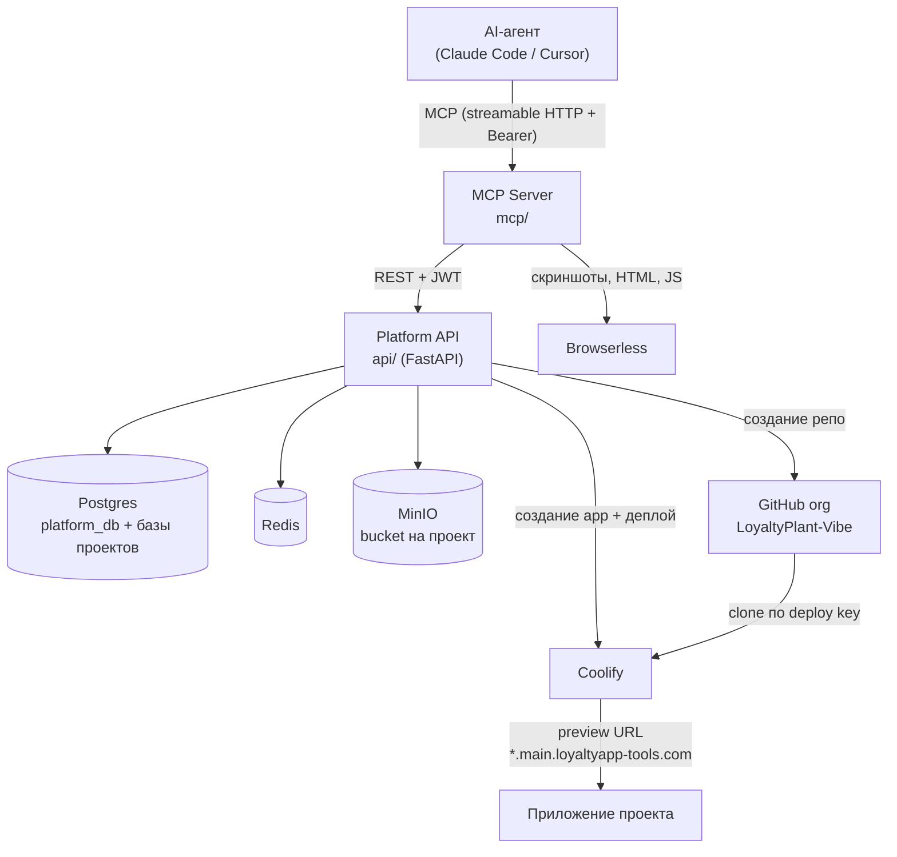
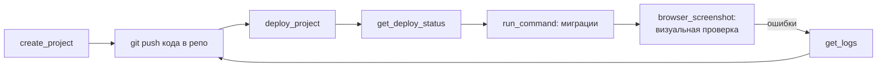

# LPVibe — внутренняя vibe-coding платформа

Replit-подобная платформа для быстрого создания и деплоя проектов через AI-агентов.
Агент (Claude Code, Cursor и т.п.) подключается к MCP-серверу и получает инструменты:
создать проект → получить готовый GitHub-репозиторий, Postgres-базу, MinIO-bucket и
задеплоенное приложение с публичным URL. Плюс браузерные инструменты для визуальной
проверки результата.

## Продакшен-эндпоинты

| Сервис | URL |
|---|---|
| Platform API | https://api.main.loyaltyapp-tools.com |
| MCP Server | https://mcp.main.loyaltyapp-tools.com/mcp |
| Coolify (оркестрация деплоев) | main.loyaltyapp-tools.com |

## Архитектура



При создании проекта Platform API провижинит **атомарно, с откатом при ошибке**:

1. GitHub-репозиторий (приватный, org `LoyaltyPlant-Vibe`) + персональный deploy key
   (ed25519-пара на проект: приватный ключ → Coolify, публичный read-only → репо)
2. Postgres-базу и роль с паролем
3. MinIO-bucket с отдельным ключом доступа
4. Coolify-проект и приложение с привязкой к репо по SSH

Репозиторий создаётся пустым: после первого пуша кода с Dockerfile деплой
запускается вручную через `deploy_project` (вебхука GitHub → Coolify нет).

## Подключение MCP к Claude Code

```bash
claude mcp add lpvibe --transport http https://mcp.main.loyaltyapp-tools.com/mcp \
  --header "Authorization: Bearer <MCP_CLIENT_TOKEN>"
```

Токен — у владельца платформы (env `MCP_CLIENT_TOKEN` MCP-сервера в Coolify).

Полная инструкция подключения и скилл `lpvibe` для Claude Code живут в
[ai-toolkit](https://git.loyaltyplant.com/vibecoding/ai-toolkit):
`skills/lpvibe/` + `skills/lpvibe/references/mcp-setup.md`.

## Инструменты MCP

| Инструмент | Что делает |
|---|---|
| `health_check` | Здоровье Platform API и зависимостей (PG, Redis, MinIO) |
| `list_projects` | Список проектов пользователя |
| `create_project` | Создать проект (имя + шаблон: `fastapi-api`, `nextjs-app`) |
| `get_project` | Метаданные проекта по UUID |
| `delete_project` | Удалить проект и откатить все ресурсы |
| `deploy_project` | Запустить деплой вручную |
| `get_deploy_status` | Статус приложения (`running:healthy` и т.п.) + preview URL |
| `get_logs` | Хвост логов контейнера (до ~500 строк) |
| `run_command` | Выполнить shell-команду в контейнере (миграции, seed) |
| `browser_screenshot` | PNG-скриншот любого URL (viewport или full page) |
| `browser_content` | HTML страницы после выполнения JS |
| `browser_evaluate` | Выполнить JS-выражение на странице |

Типовой флоу агента:



Шаблоны проектов описаны в [docs/templates_reference.md](docs/templates_reference.md).

## Структура репозитория

```
api/    — Platform API: FastAPI + SQLAlchemy (async) + Alembic. Вся оркестрация ресурсов.
mcp/    — MCP Server: FastMCP (streamable HTTP), тонкий клиент к Platform API + browserless.
docs/   — спека платформы, архитектура, планы внедрения.
```

## Platform API (api/)

REST под `/projects`, аутентификация — JWT (`Authorization: Bearer`).

| Метод | Путь | Что делает |
|---|---|---|
| GET | `/health` | здоровье сервиса и зависимостей |
| POST | `/projects` | создать проект |
| GET | `/projects` | список проектов |
| GET | `/projects/{id}` | метаданные проекта |
| GET | `/projects/{id}/logs` | логи контейнера |
| GET | `/projects/{id}/status` | статус + preview URL |
| POST | `/projects/{id}/exec` | команда в контейнере |
| POST | `/projects/{id}/deploy` | запустить деплой |
| DELETE | `/projects/{id}` | удалить проект + ресурсы |

Ключевые env (см. [api/app/config.py](api/app/config.py)):
`DATABASE_URL`, `PG_ADMIN_DSN`, `REDIS_URL`, `MINIO_*`, `GH_ADMIN_TOKEN`, `GH_ORG`,
`COOLIFY_API_URL`, `COOLIFY_API_TOKEN`, `COOLIFY_SERVER_UUID`, `JWT_SIGNING_KEY`,
`PLATFORM_DOMAIN`.

## MCP Server (mcp/)

FastMCP поверх Starlette, транспорт — streamable HTTP, авторизация клиентов — статический
Bearer-токен. К Platform API ходит с сервисным JWT, который подписывает сам.

Ключевые env (см. [mcp/app/config.py](mcp/app/config.py)):
`PLATFORM_API_URL`, `JWT_SIGNING_KEY` (тот же, что у API), `MCP_SERVICE_USER_ID`,
`MCP_CLIENT_TOKEN`, `BROWSERLESS_URL`, `BROWSERLESS_TOKEN`.

## Локальная разработка

```bash
# Platform API
cd api
pip install -e ".[dev]"
pytest                          # юнит-тесты (все внешние сервисы замоканы)
uvicorn app.main:app --reload   # нужен .env с DATABASE_URL и т.д.

# MCP Server
cd mcp
pip install -e .
python -m app.main              # слушает :8001
```

## Деплой

Оба сервиса деплоятся в Coolify как отдельные приложения из этого репозитория
(каждый со своим Dockerfile: `api/Dockerfile`, `mcp/Dockerfile`). Env-переменные
задаются в Coolify. Подробности и UUID инфраструктуры — во внутренних доках.

## Документация

- [docs/platform_spec.md](docs/platform_spec.md) — спецификация платформы
- [docs/internal_replit_platform_architecture.md](docs/internal_replit_platform_architecture.md) — архитектура
- [docs/templates_reference.md](docs/templates_reference.md) — шаблоны проектов
- [docs/2026-04-14-platform-design.md](docs/2026-04-14-platform-design.md) — дизайн-документ
