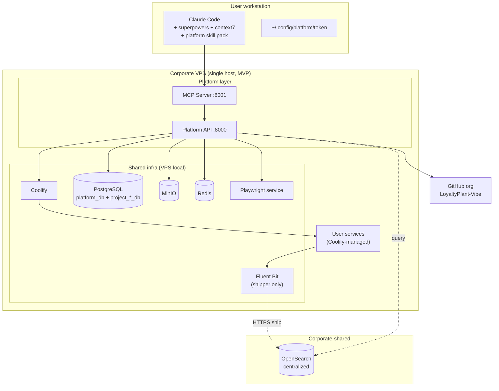
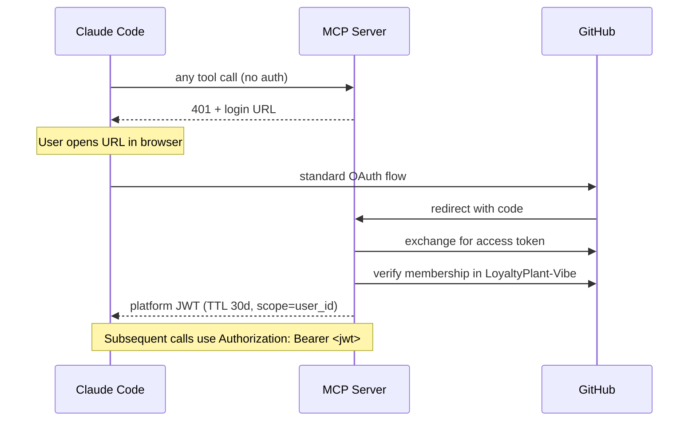

# LPVibe Internal AI Development Platform — Design

**Status:** Design (supersedes `platform_spec.md`, `internal_replit_platform_architecture.md`, `internal_replit_platform_implementation_plan.md`, `templates_reference.md` as the single source of truth for implementation).

**Date:** 2026-04-14

**Owners:** k.ivanov

---

## 1. Purpose

Build an internal AI development platform that gives employees a Replit-like experience for creating, deploying, and iterating on small services — while running entirely on company infrastructure (single corporate VPS running Coolify + supporting services). Claude Code is the primary development agent; the platform exposes capabilities to it via an MCP server.

**Key differentiators from vanilla Claude Code + manual setup:**

1. Shared infrastructure credentials (GitHub org, Coolify, Postgres, MinIO, Playwright) are held by the platform and never exposed to end users.
2. A project-local memory subsystem (journal, lessons, state) that carries context across Claude sessions and prevents the agent from repeating failed attempts.
3. Server-side anti-loop detection that interrupts Claude when it retries the same failing operation.
4. Pre-baked templates with a stable Platform SDK abstracting infra concerns.
5. Environment checks (superpowers, context7, required CLIs) enforced before operations.

**Primary users:**
- Engineers (existing Claude Code users) — advanced mode.
- Non-engineers (e.g. CEO) — give Claude Code a request, receive a working deployed service.

## 2. Non-Goals

- Replacing Claude Code itself. We wrap it, not replace it.
- Supporting arbitrary stacks. Stack is intentionally constrained (see §6).
- Multi-tenant isolation beyond per-user GitHub identity and per-project Postgres DB / MinIO bucket. This is an internal tool on a trusted corporate network.
- Building our own dashboard UI, alerting system, or metrics pipeline. We integrate with the centralized corporate OpenSearch but otherwise defer UI concerns.
- Preview-per-branch, cost controls, quotas — tracked as future work (§12).

## 3. Stack Decisions

| Concern | Choice | Rationale |
|---|---|---|
| Deployment orchestrator | Coolify | Company is migrating here anyway; handles Docker build, auto-deploy from git, env injection, routing. |
| Platform API language | Python 3.11 + FastAPI | Matches template primary language; first-class async; strong ecosystem for GitHub/Coolify/MinIO/PG SDKs. |
| MCP Server language | Python 3.11 + FastAPI + `mcp` SDK | Same runtime as Platform API; colocated. |
| Database (platform metadata) | PostgreSQL single cluster; dedicated `platform_db` | Simple; aligned with per-project DB pattern. |
| Database (per project) | PostgreSQL `project_{id}_db` in same cluster | Chatgpt spec §6; simple provisioning. |
| Object storage | MinIO (S3-compatible) | Self-hosted; bucket-per-project. |
| Queue / locks | Redis | Distributed locks for provisioning ops, MCP call-history TTL. |
| Log shipper | Fluent Bit (VPS-local) | Lightweight; enriches with `project_id`. |
| Log sink | **Corporate centralized OpenSearch** | Company already operates this — we integrate, do not host. |
| E2E browser tests | Shared Playwright service | Single corporate instance reused across projects. |
| Auth (MCP ↔ user) | GitHub OAuth + org membership check → platform-issued JWT | Every user already has a company GH account and org membership. |
| Secrets management (MVP) | `.env` file on Platform API container (root-owned, 600) | Sufficient for single-VPS MVP; Vault later. |

## 4. Topology

Single VPS running docker-compose with all platform components. Deployed user services run as sibling containers managed by Coolify on the same host. Scale-out happens by extracting PostgreSQL and MinIO to dedicated hosts later — no architectural change required.



## 5. Authentication and Secrets

### 5.1 User auth (Claude Code → MCP)

Flow: GitHub OAuth → org membership verification → platform-issued JWT.



- JWT carries `user_id`, `github_login`, `scope`, `jti`, `exp`.
- Refresh flow re-verifies org membership against GitHub at each refresh.
- Revocation: remove user from GH org (natural expiry at next refresh) OR immediate blacklist by `jti` in Redis.
- Audit log in `platform_db.audit_log` records `user_id`, `action`, `project_id`, `ts`, `result`.

### 5.2 Shared service credentials

Held exclusively in Platform API process environment (`.env` file, permissions 600, file not checked into git). Never surfaced to MCP responses. Required credentials:

- `GH_ADMIN_TOKEN` — GitHub PAT with `repo`, `admin:org` on `LoyaltyPlant-Vibe`.
- `COOLIFY_API_TOKEN` — Coolify admin token.
- `PG_ADMIN_URL` — Postgres superuser DSN for provisioning DBs/users.
- `MINIO_ADMIN_ACCESS_KEY`, `MINIO_ADMIN_SECRET_KEY` — MinIO root creds.
- `OPENSEARCH_URL`, `OPENSEARCH_AUTH` — corporate OpenSearch query endpoint + bearer/basic auth.
- `PLAYWRIGHT_SERVICE_URL`, `PLAYWRIGHT_AUTH` — shared headless browser endpoint.
- `JWT_SIGNING_KEY` — symmetric HS256 key for platform JWTs.
- `GH_OAUTH_CLIENT_ID`, `GH_OAUTH_CLIENT_SECRET` — OAuth app.

### 5.3 Credential injection into user-deployed services

The Platform API provisions per-project credentials and passes them to Coolify at deploy time as environment variables on the user's container. User code sees only project-scoped credentials (its own DB, its own bucket), never admin-level ones.

Standard injected env contract (all templates rely on it):

```
DATABASE_URL            # postgres://project_user:pass@pg/project_db
S3_ENDPOINT, S3_ACCESS_KEY, S3_SECRET_KEY, S3_BUCKET
PLATFORM_API_URL        # for SDK callbacks
PLATFORM_PROJECT_ID     # identity / log tagging
LOG_LEVEL               # default info
```

## 6. MCP Tool Surface

Intentionally granular (not a single `platform.run(task)` universal tool). Each tool has a typed input schema, a typed output schema, and a `next_hint` field in the response to guide Claude's next action.

### 6.1 `infra.*` — infrastructure operations

| Tool | Description |
|---|---|
| `list_templates()` | Returns available templates with manifests. |
| `create_project(name, template)` | Atomic: GH repo + PG DB + MinIO bucket + Coolify app + template push. Returns `{project_id, repo_url, preview_url, state}`. |
| `get_project(id)` / `list_projects()` / `delete_project(id)` | CRUD. Delete cleans up repo, DB, bucket, Coolify app. |
| `run_command(project_id, cmd, timeout=60)` | Executes command in sandboxed container (memory=512m, cpus=0.5, pids=100, read-only FS). Returns `{stdout, stderr, exit_code}`. |
| `get_logs(project_id, last=100, level=None, since=None)` | Queries corporate OpenSearch by `project_id` tag. |
| `get_deploy_status(project_id)` | Pulls Coolify status. |
| `redeploy(project_id)` | Force Coolify rebuild. |

### 6.2 `env.*` — user-environment validation

| Tool | Description |
|---|---|
| `check_environment()` | Verifies Claude Code version, superpowers plugin, context7 MCP, `gh auth status`, `docker`. Returns per-check status with remediation steps. |
| `install_skill(name)` | Instructs CC to install a required skill (via CC's Skill tool contract). |
| `get_required_skills()` | Canonical list of skills/tools CC must have before calling `infra.*`. |

### 6.3 `guide.*` — playbooks and prompts

| Tool | Description |
|---|---|
| `get_playbook(scenario)` | Returns markdown playbook for: `new_service`, `deploy_fix`, `db_migration`, `e2e_setup`, `debug_loop`. |
| `get_prompt_template(scenario)` | Rarely used in MVP; CLAUDE.md injected at bootstrap carries most of this (see §9). |

### 6.4 `memory.*` — project memory

| Tool | Description |
|---|---|
| `log_attempt(kind, tool, args, result, error?, context?)` | Append to `.platform/memory/journal.jsonl` in the project repo. |
| `add_lesson(title, symptom, cause, fix)` | Append to `.platform/memory/lessons.md`. |
| `get_related_failures(topic)` | Searches project journal + lessons locally, then broadens to GitHub Code Search API (`/search/code`) scoped to the `LoyaltyPlant-Vibe` org, matching inside `.platform/memory/` paths across other repos. All GitHub API calls execute server-side using `GH_ADMIN_TOKEN`. |
| `get_session_digest(project_id)` | At session open: last 10 journal entries, open blockers, last 5 lessons, current milestone. |

### 6.5 `progress.*` — project state machine

| Tool | Description |
|---|---|
| `get_state(project_id)` | Reads `.platform/state.yaml`. |
| `update_milestone(project_id, milestone)` | Advances state. Milestones: `created → scaffolded → db_provisioned → deployed → tests_passing → production_ready`. |

### 6.6 `integ.*` — external integrations

| Tool | Description |
|---|---|
| `run_e2e(project_id, scenarios)` | Runs Playwright scenarios against the deployed preview URL via shared service. |
| `get_e2e_report(run_id)` | Fetches run results. |
| `setup_logs(project_id)` | Re-verifies Fluent Bit config for this project; normally done at `create_project`. |

## 7. Data Flows

### 7.1 Create project (happy path)

```mermaid
sequenceDiagram
    autonumber
    participant U as User
    participant CC as Claude Code
    participant MCP as MCP
    participant API as Platform API
    participant GH as GitHub
    participant PG as Postgres
    participant Min as MinIO
    participant Co as Coolify

    U->>CC: "create image upload service"
    CC->>MCP: guide.get_playbook("new_service")
    MCP-->>CC: markdown playbook
    CC->>MCP: infra.list_templates()
    MCP-->>CC: [fastapi-api, nextjs-app, worker, image-service, ...]
    CC->>U: "I'll use image-service, confirm?"
    U-->>CC: yes
    CC->>MCP: infra.create_project(name=img-svc, template=image-service)
    MCP->>API: POST /projects
    par
        API->>GH: create repo LoyaltyPlant-Vibe/img-svc
        API->>PG: CREATE DATABASE project_img_svc_db
        API->>Min: create bucket project-img-svc-files
    end
    API->>GH: push template contents
    API->>Co: create app, link repo, inject env
    API->>PG: INSERT platform_db.projects
    API-->>MCP: {project_id, repo_url, preview_url}
    MCP-->>CC: result + next_hint:<br/>"clone repo, edit, push; auto-deploy triggers"
```

### 7.2 Edit → test → deploy loop

Standard inner loop. User cloned repo locally (or works via `infra.run_command`). Claude edits, runs tests via `infra.run_command`, on green pushes. Coolify webhook triggers rebuild. Claude polls `infra.get_deploy_status`.

### 7.3 Debug loop with anti-loop interrupt

Every call to `infra.run_command` and `infra.get_logs` is hashed by `(tool, project_id, args_fingerprint, error_fingerprint)` and stored in Redis with a 10-minute TTL counter. When the counter reaches 4 within the window, MCP returns an interrupt response instead of executing:

```json
{
  "interrupt": true,
  "reason": "loop_detected",
  "message": "You've called infra.run_command(pytest) 4 times in 10 minutes with the same error. Stop. Read .platform/memory/lessons.md. Change approach or ask the user.",
  "suggested_next": [
    "memory.get_related_failures(topic='pytest boto3')",
    "ask_user_for_guidance"
  ]
}
```

Claude is instructed (via CLAUDE.md, see §9) to honor the interrupt: consult memory, change strategy, or escalate to the user.

## 8. Memory Subsystem

Stored inside the project's own git repository under `.platform/memory/`. This trades central searchability for transparency, offline access, and zero extra DB dependency for MVP.

Cross-project search is achieved via `gh search code --owner LoyaltyPlant-Vibe`, invoked by `memory.get_related_failures`.

### 8.1 File layout

```
.platform/
  memory/
    journal.jsonl       # append-only; Claude writes via memory.log_attempt
    lessons.md          # curated by Claude via memory.add_lesson
  state.yaml            # updated by MCP via progress.update_milestone
```

### 8.2 Example journal line

```json
{"ts":"2026-04-14T10:23:11Z","kind":"attempt","tool":"infra.run_command","args":{"cmd":"pytest"},"result":"fail","error":"ImportError: boto3","context":"test_upload"}
```

### 8.3 Example lesson

```markdown
## Lesson: boto3 import fails when minio SDK dependency is missing

Symptom: ImportError: boto3 in sandbox runtime
Cause: platform/storage.py imports boto3, but requirements.txt did not list it
Fix: add `boto3>=1.34` to requirements.txt. Verified 2026-04-14.
```

### 8.4 Write policy (MVP)

Claude writes explicitly using `memory.log_attempt` / `memory.add_lesson`. CLAUDE.md (injected per template, see §9) instructs Claude to call these after each non-trivial operation. Future (v2): MCP auto-logs every tool call as a low-level journal entry, with Claude layering high-level lessons on top.

### 8.5 Session open

When Claude opens a project, it calls `memory.get_session_digest(project_id)`. Response includes current state, last 10 journal entries tagged `fail`, top 5 lessons, any `blockers`. Digest is what Claude sees before attempting anything.

## 9. Templates and Platform SDK

Templates live in a dedicated repo `LoyaltyPlant-Vibe/platform-templates`. AI modifies templates in place; it does not generate projects from scratch.

### 9.1 MVP template set

1. `fastapi-api` — Python, FastAPI, `/health`, tests, Dockerfile.
2. `nextjs-app` — Next.js 14 standalone, Dockerfile.
3. `worker` — Python long-running background worker.
4. `image-service` — FastAPI + MinIO upload + DB records; the reference template demonstrating full SDK usage.
5. `telegram-bot` — `python-telegram-bot` polling.
6. `fullstack-app` — FastAPI backend + Next.js frontend in a monorepo.

### 9.2 Common template structure

```
<template>/
  Dockerfile
  docker-compose.dev.yml         # local mock infra
  template.yaml                  # manifest: name, stack, features, required_env
  .platform/
    memory/
      journal.jsonl              # empty scaffold
      lessons.md                 # empty scaffold
    state.yaml                   # current: created
  CLAUDE.md                      # Claude instructions + memory hooks
  app/                           # user-editable
  platform/                      # SDK — NOT to be edited per-project
    logging.py
    storage.py
    database.py
    config.py
  tests/
    test_health.py
  README.md
```

### 9.3 Platform SDK contract

User code uses high-level helpers; infra details are abstracted:

```python
from platform.logging import log
from platform.storage import storage
from platform.database import db

log.info("processing file")
storage.upload(file)
```

The SDK is versioned and centrally maintained. Bug fixes or enhancements to SDK are PRs to the templates repo, not to individual projects. Individual projects pick up SDK updates via `infra.upgrade_sdk(project_id)` (post-MVP tool) or by manual copy for MVP.

### 9.4 CLAUDE.md contents (template-level)

Every template's `CLAUDE.md` instructs Claude on project-specific conventions and memory hooks. Canonical content:

- "Do not edit files under `platform/`. Changes belong in the platform-templates repo."
- "Before any non-trivial operation, call `memory.get_related_failures(topic)`."
- "After any significant attempt (success or failure), call `memory.log_attempt`."
- "If a tool call fails twice with a similar error, stop and call `memory.get_related_failures`, then change approach or escalate."
- "Always run tests (`infra.run_command(project_id, 'pytest')`) before declaring done."
- "The `/health` endpoint must always return 200."

## 10. Observability

- Docker containers on VPS log to stdout.
- Fluent Bit (VPS-local) tails Docker logs, enriches each record with `project_id`, `service`, `env`, `ts`, and ships via HTTPS to the corporate OpenSearch cluster.
- Platform API queries OpenSearch on behalf of Claude via `infra.get_logs`, filtering by `project_id`.
- No per-platform Kibana or Grafana — users go to corporate OpenSearch UI when they want visual exploration.
- Future: error-to-hint heuristics server-side (e.g. Python tracebacks with common patterns map to `next_hint` suggestions).

## 11. Walking-Skeleton Delivery Plan

MVP is built as a walking skeleton (end-to-end thin slice), then layers are added. Each day ends with a working system that could, in principle, ship.

### Week 1 — Skeleton

- **Day 1** — VPS setup: Coolify, Postgres, MinIO, Redis, Fluent Bit (docker-compose). Reverse proxy + wildcard cert for `*.apps.company.dev`. Fluent Bit wired to corporate OpenSearch.
- **Day 2** — Platform API: `POST /projects`, `GET /projects/{id}`, `DELETE /projects/{id}`, `POST /runtime/run`, `GET /logs`. Integrations with GitHub, Coolify, Postgres admin, MinIO admin. Schema for `platform_db.projects`, `users`, `audit_log`.
- **Day 3** — MCP Server: GH OAuth flow, JWT issuance, Bearer middleware. Tools: `infra.create_project`, `infra.run_command`, `infra.get_logs`, `infra.get_deploy_status`, `env.check_environment`, `guide.get_playbook`. Redis anti-loop counter.
- **Day 4** — First template (`fastapi-api`) + scaffold for `image-service`. Platform SDK modules. `template.yaml` manifests. One end-to-end smoke test. Week-1 CLAUDE.md intentionally omits memory hooks (see §8) since `memory.*` tools land in Week 2.
- **Day 5** — Claude Code bootstrap: platform skill pack (tool descriptions, playbooks, required-skills list), install script that configures MCP in `~/.claude/settings.json`, post-install verification command.
- **Days 6–7** — buffer for demo / fixes / CEO pilot.

### Week 2 — Layers

- Memory subsystem: `memory.*` tools, `progress.*` tools, `.platform/memory/` scaffolding in templates, updated CLAUDE.md with memory hooks. Existing Week-1 projects retrofit via a one-shot script that adds the empty memory files.
- Remaining templates (`nextjs-app`, `worker`, `telegram-bot`, `fullstack-app`).
- `integ.*` — Playwright integration with shared service.

## 12. Future Work (out of MVP)

- Preview environments per branch (wildcard DNS already in place).
- Cost controls, resource quotas.
- Project dashboard UI.
- Secrets vault (HashiCorp Vault / Doppler / SOPS).
- Metrics pipeline (Prometheus).
- Multi-language templates (Go / Rust / Node-only backend).
- MCP-side automatic journal entries on every tool call.
- Platform SDK auto-upgrade tool.

## 13. Open Questions (to resolve before implementation)

1. Which corporate domain is used for `*.apps.company.dev`? Wildcard certificate procurement path.
2. Which corporate OpenSearch index pattern are we authorized to write to? Auth mechanism (bearer token vs basic)?
3. Shared Playwright service — does one already exist, or do we stand up the first one as part of this project?
4. Coolify instance — existing company instance or fresh install?
5. GitHub OAuth app — create under `LoyaltyPlant-Vibe` org; need admin to provision callback URL `https://mcp.internal/auth/callback`.
